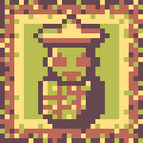
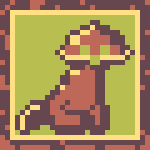
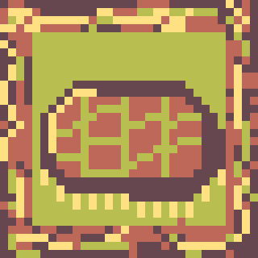
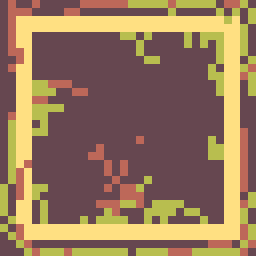
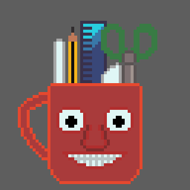
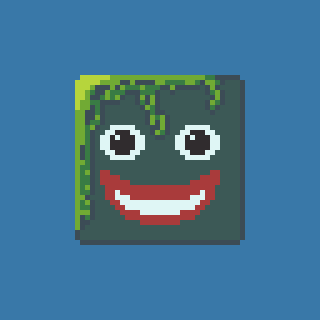

# Art
All my finished Art
### CONTENTS
[About Me](https://github.com/LinuxGamer/Art/blob/main/README.md#aboutme)
[Gallery 2022](https://github.com/LinuxGamer/Art/blob/main/README.md#gallery2022)
[2022 Bad Pieces](https://github.com/LinuxGamer/Art/blob/main/README.md#2022badpieces)

### About Me
I'm Linux Gamer; I'm an artist (digital, pixel, and animator), gamer, content creator (Twitch and YouTube), programmer and game developer.
I enjoy doing most of my art digitally (at the moment, I am enjoying doing a lot of Pixel Art stuff (using Libresprite) and also drawing digitally (using Krita). For my coding, I use either VS Code or Kate. For gamedev, I use Godot or pygame.
I am British, so I speak fluent English, but I'm currently learning Welsh and Dutch.
I contribute to Libresprite and work on my own projects like Artlsy.

### Gallery 2022

Date: September 1st 2022

Name: RoboMcdonald (Septembit 1st)

Description: Day 1 of Saultoons Septembit challenge (prompt of farmer). Named RoboMcdonald because he's a robot and a famous farmer is Old Mcdonald XD.

Date: September 1st 2022

Name: Firefly

Description: Day 2 of Saultoons' Septembit challenge (prompt of pet). Named Firefly because it's a cool name and matches the colours, btw he's a cat.

Date: September 2nd 2022

Name: RoboTractor

Description: Day 3 of Saultoon's Septembit challenge (prompt of tractor). 

Date: September 2nd 2022

Name: Dirt

Description: Day 4 of Saultoon's Septembit challenge (prompt of dirt).

### 2022 Bad Pieces

